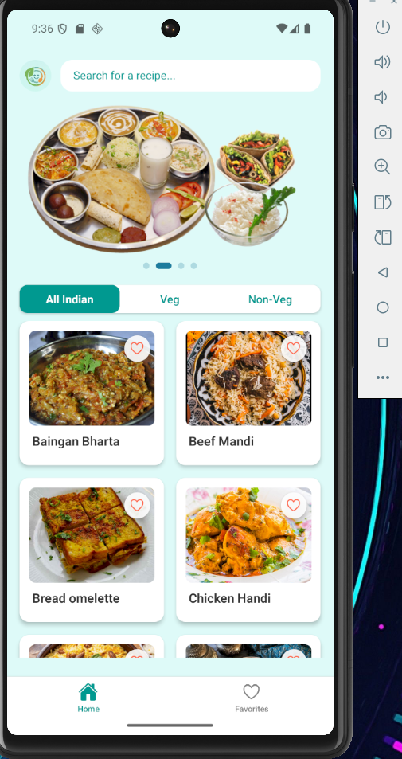
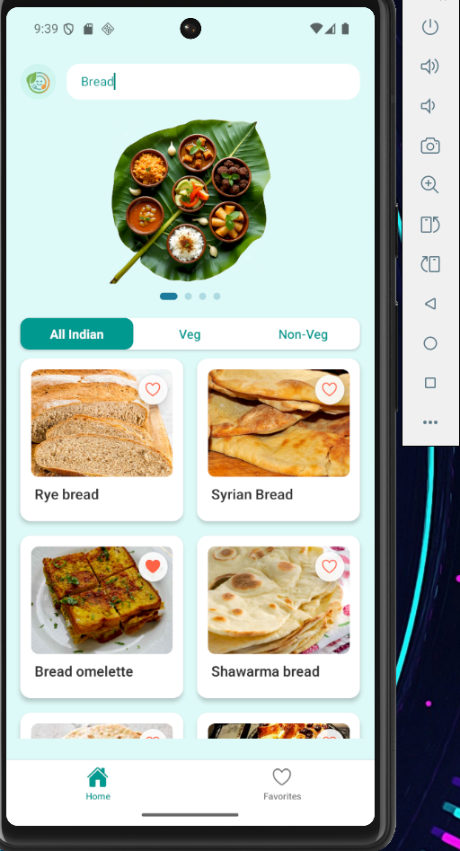
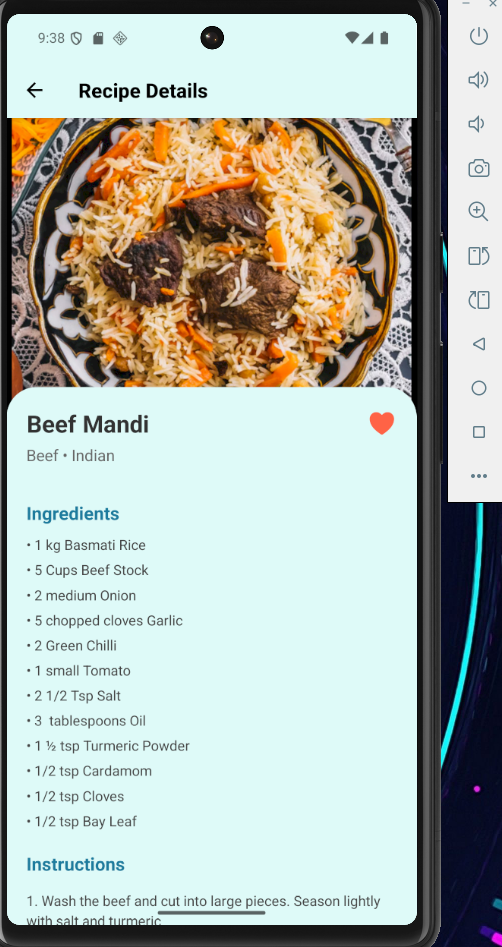
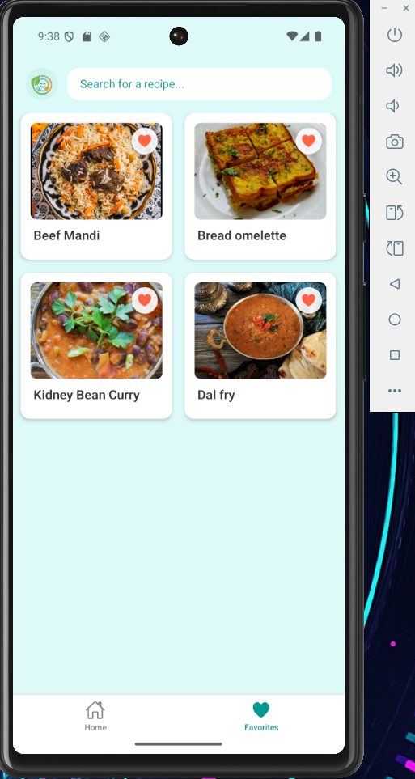

# Mealify 🥗 

A beautifully designed, cross-platform recipe discovery application built with React Native. Mealify allows users to browse global and regional cuisines, filter by dietary preferences, and save their favorite recipes locally.

## ✨ Features

* **Smart Search & Filtering:** Instantly search for recipes globally or filter specifically by category (e.g., All Indian, Veg, Non-Veg) using a custom-built segmented tab control.
* **State Management:** Utilizes **Redux** to manage global state, allowing users to effortlessly save and remove favorite recipes across different screens.
* **Dynamic UI Components:** Features a custom auto-scrolling image carousel with interactive pagination dots, built entirely with native components for maximum performance.
* **Responsive Layouts:** Implements modern Flexbox techniques to ensure pixel-perfect rendering across varying screen sizes.
* **API Integration:** Seamlessly fetches and filters asynchronous data from [TheMealDB API](https://www.themealdb.com/api.php).

## 🛠️ Tech Stack

* **Framework:** React Native
* **State Management:** Redux / React-Redux
* **Navigation:** React Navigation (Bottom Tabs & Stack Navigator)
* **Networking:** Axios 
* **Icons:** React Native Vector Icons


##  Screenshots

| Home Screen | Filtered View | Recipe Details | Favorites |
|:---:|:---:|:---:|:---:|
|  |  |  |  |


## 🚀 Getting Started

### Prerequisites
* Node.js
* React Native CLI
* Android Studio or Xcode (for iOS)

### Installation

1. **Clone the repository:**
   ```bash
   git clone [https://github.com/Ahilasuki/Mealify.git](https://github.com/Ahilasuki/Mealify.git)